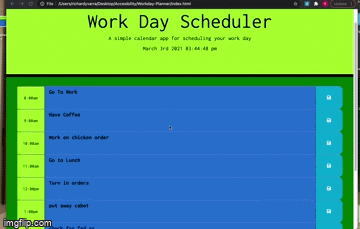

# Workday-Planner
This workday planner has the current time, with a running clock. Each time block changes color with current, past, and future time.  The save button when pressed, saves content on page to local storage.  In the future I wish to have the planner reset when a new day is started.

## Technology 
Javascript, CSS, HTML, Font Awesome, Google Fonts.

## Application In Use

## Links
*[https://github.com/Vinyl77/Workday-Planner]
*[https://vinyl77.github.io/Workday-Planner]
